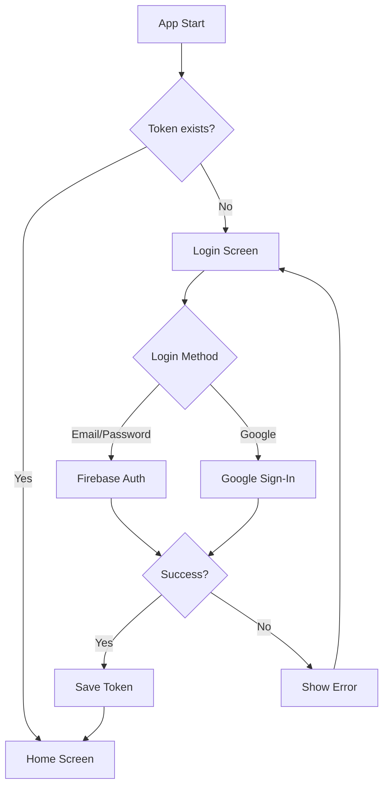
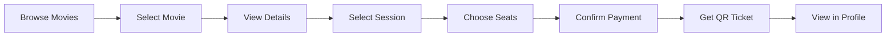

# 🎬 Cinema Booking App

<p align="center">
  
</p>

<p align="center">
  <strong>Ứng dụng đặt vé xem phim đa nền tảng được xây dựng bằng Flutter</strong>
</p>

<p align="center">
  
  
  
  
</p>

---

## 📖 Giới thiệu

**Cinema Booking App** là ứng dụng di động đa nền tảng (iOS & Android) cho phép người dùng duyệt phim, xem lịch chiếu, chọn ghế ngồi và đặt vé xem phim một cách dễ dàng. Ứng dụng được xây dựng với kiến trúc Clean Architecture, đảm bảo code dễ bảo trì và mở rộng.

---

## ✨ Tính năng chính

### 🏠 Trang chủ (Home)
- **Carousel phim sắp chiếu** - Tự động phát với smooth animation
- **Grid phim đang chiếu** - Hiển thị poster, tên phim và thể loại
- **Tìm kiếm phim** - Tìm kiếm nhanh theo tên
- **Shimmer loading effect** - UX mượt mà khi tải dữ liệu

### 🎬 Chi tiết phim (Movie Detail)
- **Tab About** - Thông tin chi tiết: mô tả, thể loại, thời lượng, đánh giá
- **Tab Sessions** - Danh sách suất chiếu theo ngày và rạp
- **YouTube Trailer** - Xem trailer trực tiếp trong app

### 🎟️ Đặt vé (Ticket Booking)
- **Sơ đồ ghế tương tác** - Chọn ghế trực quan với legend (Available/Occupied/Chosen)
- **Real-time availability** - Cập nhật trạng thái ghế theo thời gian thực
- **Xác nhận thanh toán** - Bottom sheet với thông tin chi tiết đơn hàng
- **Mã QR vé điện tử** - Sinh mã QR sau khi đặt vé thành công

### 👤 Quản lý tài khoản (Profile)
- **Đăng nhập/Đăng ký** - Email/Password authentication
- **Google Sign-In** - Đăng nhập nhanh với tài khoản Google
- **Chỉnh sửa thông tin** - Họ tên, ngày sinh, số điện thoại, giới tính, thành phố
- **Upload avatar** - Chọn ảnh từ thư viện và upload lên Firebase Storage
- **Lịch sử thanh toán** - Xem danh sách vé đã đặt

### ⚙️ Cài đặt (Settings)
- **Đa ngôn ngữ** - Hỗ trợ Tiếng Anh và Tiếng Việt
- **Thông báo** - Bật/tắt nhận thông báo
- **Dark Mode** - Giao diện tối mặc định

---

## 🛠️ Công nghệ sử dụng

### Core Framework
| Công nghệ | Mô tả |
|-----------|-------|
| **Flutter 3.3+** | Cross-platform UI framework |
| **Dart 3.0+** | Programming language |

### State Management & Architecture
| Package | Mô tả |
|---------|-------|
| `flutter_bloc` | BLoC Pattern for state management |
| Clean Architecture | Data - Domain - Presentation layers |

### Backend & Database
| Service | Mô tả |
|---------|-------|
| **Firebase Auth** | Authentication (Email/Password, Google) |
| **Cloud Firestore** | NoSQL database for user data & tickets |
| **Firebase Storage** | Image storage (avatars) |
| **REST API** | Movie data via external API |

### Networking
| Package | Mô tả |
|---------|-------|
| `dio` | HTTP client |
| `retrofit` | Type-safe REST API calls |
| `json_serializable` | JSON serialization/deserialization |

### UI Components
| Package | Mô tả |
|---------|-------|
| `carousel_slider` | Movie carousel on home page |
| `smooth_page_indicator` | Page indicators |
| `cached_network_image` | Image caching |
| `shimmer` | Loading placeholder effects |
| `youtube_player_flutter` | YouTube video player |
| `qr_flutter` | QR code generation |
| `flutter_svg` | SVG rendering |

### Utilities
| Package | Mô tả |
|---------|-------|
| `shared_preferences` | Local storage |
| `image_picker` | Image selection |
| `flutter_easyloading` | Loading indicators |
| `intl` | Internationalization |

---

## 🏗️ Kiến trúc dự án

Dự án được xây dựng theo **Clean Architecture** với 3 layer chính:

```
lib/
├── apps/                    # App configuration
│   └── config/              # Colors, themes config
├── core/                    # Core utilities
│   ├── common/              # Shared components
│   │   └── userPreferences/ # Local storage management
│   ├── routes/              # Navigation routes
│   ├── themes/              # App themes (light/dark)
│   └── utils/               # Utilities (date, dio client)
├── features/                # Feature modules
│   ├── auths/               # Authentication feature
│   │   ├── data/            # Data sources, models
│   │   ├── domain/          # Entities, repositories
│   │   └── presentation/    # BLoC, views
│   ├── home/                # Home feature
│   │   ├── data/
│   │   ├── domain/
│   │   └── presentation/
│   ├── movie_detail/        # Movie detail feature
│   │   ├── data/
│   │   ├── domain/
│   │   └── presentation/
│   ├── ticket/              # Ticket booking feature
│   │   ├── data/
│   │   ├── domain/
│   │   └── presentation/
│   ├── ticket_detail/       # Ticket detail with QR
│   │   └── presentation/
│   └── profile/             # User profile feature
│       ├── data/
│       ├── domain/
│       └── presentation/
├── l10n/                    # Localization files
├── widgets/                 # Shared widgets
├── firebase_options.dart    # Firebase configuration
├── main.dart                # Entry point
└── my_app.dart              # App widget
```

### Layer Details

```
┌─────────────────────────────────────────────────────────────┐
│                    PRESENTATION LAYER                        │
│  ┌─────────────┐  ┌─────────────┐  ┌─────────────────────┐  │
│  │   Views     │  │    BLoC     │  │      States         │  │
│  │  (Widgets)  │◄─┤   (Logic)   │──┤     (Events)        │  │
│  └─────────────┘  └──────┬──────┘  └─────────────────────┘  │
├──────────────────────────┼──────────────────────────────────┤
│                    DOMAIN LAYER                              │
│  ┌─────────────┐  ┌──────┴──────┐  ┌─────────────────────┐  │
│  │  Entities   │  │ Repositories│  │     Use Cases       │  │
│  │  (Models)   │  │ (Interface) │  │    (Business)       │  │
│  └─────────────┘  └──────┬──────┘  └─────────────────────┘  │
├──────────────────────────┼──────────────────────────────────┤
│                     DATA LAYER                               │
│  ┌─────────────┐  ┌──────┴──────┐  ┌─────────────────────┐  │
│  │   Models    │  │ Repository  │  │    Data Sources     │  │
│  │   (DTO)     │  │   (Impl)    │  │  (API/Firebase)     │  │
│  └─────────────┘  └─────────────┘  └─────────────────────┘  │
└─────────────────────────────────────────────────────────────┘
```

---

## 🚀 Bắt đầu

### Yêu cầu hệ thống
- Flutter SDK 3.3.0 trở lên
- Dart SDK 3.0.0 trở lên
- Android Studio / VS Code
- Xcode (cho iOS development)

### Cài đặt

1. **Clone repository**
```bash
git clone https://github.com/your-username/app-cinema-vti.git
cd app-cinema-vti
```

2. **Cài đặt dependencies**
```bash
flutter pub get
```

3. **Cấu hình Firebase**
   - Tạo project trên [Firebase Console](https://console.firebase.google.com/)
   - Thêm app Android/iOS vào project
   - Tải file `google-services.json` (Android) và `GoogleService-Info.plist` (iOS)
   - Đặt vào thư mục tương ứng

4. **Generate code (JSON serialization)**
```bash
dart run build_runner build --delete-conflicting-outputs
```

5. **Chạy ứng dụng**
```bash
flutter run
```

### Build Production

**Android APK:**
```bash
flutter build apk --release
```

**Android App Bundle:**
```bash
flutter build appbundle --release
```

**iOS:**
```bash
flutter build ios --release
```

---

## 📁 Cấu trúc Feature

Mỗi feature trong `lib/features/` được tổ chức theo cấu trúc:

```
feature_name/
├── data/
│   ├── datasource/          # API calls, Firebase queries
│   └── model/               # Data models (DTO)
├── domain/
│   ├── entities/            # Business entities
│   └── repositories/        # Repository interfaces
└── presentation/
    ├── bloc/                # BLoC files
    │   ├── feature_bloc.dart
    │   ├── feature_event.dart
    │   └── feature_state.dart
    ├── views/               # UI screens
    │   ├── feature_screen.dart
    │   └── widgets/         # Feature-specific widgets
    └── feature_route.dart   # Route definition
```

---

## 🔐 Authentication Flow



---

## 🎫 Booking Flow



---

## 🌐 API Endpoints

Ứng dụng giao tiếp với backend thông qua REST API:

| Method | Endpoint | Mô tả |
|--------|----------|-------|
| GET | `/movies/upcoming` | Lấy danh sách phim sắp chiếu |
| GET | `/movies/{id}` | Lấy chi tiết phim |
| GET | `/movies/{id}/sessions` | Lấy suất chiếu của phim |
| GET | `/sessions/{id}/seats` | Lấy sơ đồ ghế |
| POST | `/tickets` | Tạo vé mới |

---

## 📱 Screenshots

<p align="center">
  <i>Screenshots sẽ được cập nhật sau</i>
</p>

<!-- 
Uncomment và thêm đường dẫn ảnh khi có screenshots:

| Home | Movie Detail | Seat Selection | Profile |
|:----:|:------------:|:--------------:|:-------:|
|  |  |  |  |
-->

---

## 🧪 Testing

```bash
# Unit tests
flutter test

# Integration tests
flutter test integration_test/
```

---

## 📝 Conventions

### Code Style
- Sử dụng `flutter_lints` cho lint rules
- Đặt tên file: `snake_case.dart`
- Đặt tên class: `PascalCase`
- Đặt tên biến/function: `camelCase`

### Commit Messages
```
feat: Add new feature
fix: Bug fix
refactor: Code refactoring
docs: Documentation updates
style: Code style changes
test: Add/update tests
```

---

## 🤝 Contributing

1. Fork repository
2. Tạo feature branch (`git checkout -b feature/AmazingFeature`)
3. Commit changes (`git commit -m 'feat: Add AmazingFeature'`)
4. Push to branch (`git push origin feature/AmazingFeature`)
5. Mở Pull Request

---

## 📄 License

Distributed under the MIT License. See `LICENSE` for more information.

---

## 👨‍💻 Tác giả

**Kang Lee**

- GitHub: [@kanglee079](https://github.com/kanglee079)

---

## 🙏 Acknowledgments

- [Flutter](https://flutter.dev/)
- [Firebase](https://firebase.google.com/)
- [BLoC Library](https://bloclibrary.dev/)
- [The Movie Database API](https://www.themoviedb.org/)

---

<p align="center">
  Made with ❤️ and Flutter
</p>
